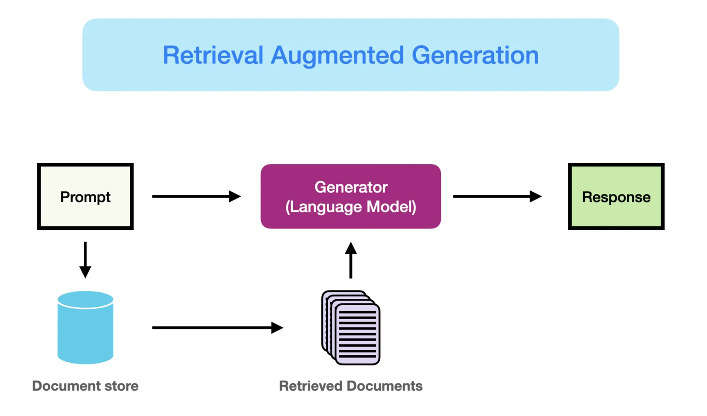
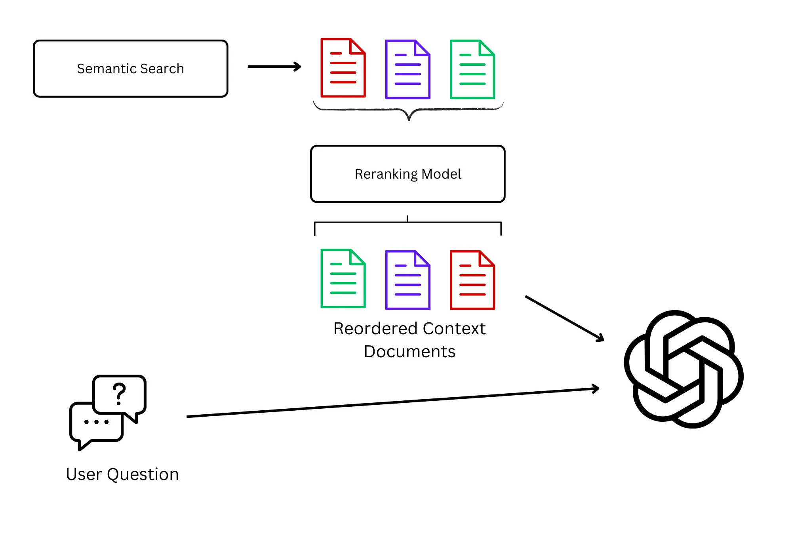
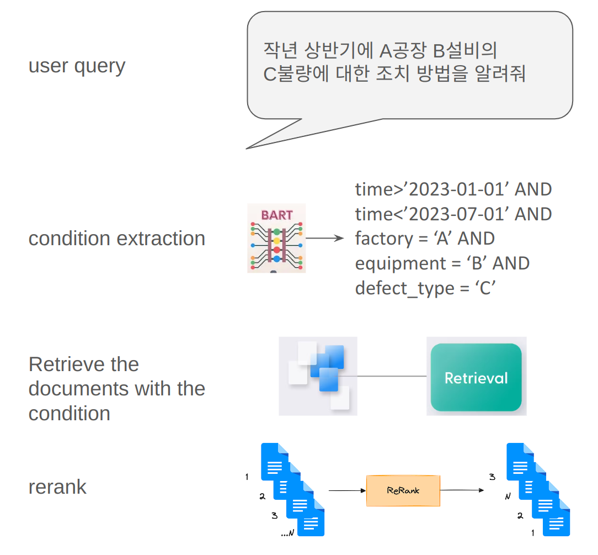
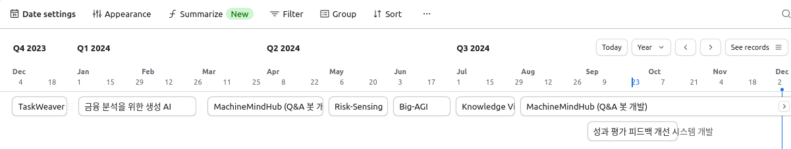

# 프로젝트 및 경험

### **LG 디스플레이 (연구원, 생성 AI 및 자연어 처리)**  
**2023년 10월 – 현재**

 

#### 1. **성과 평가 피드백 개선 시스템 개발**
- **설명**: 성과평가 시즌에 구성원이 공정하고 유용한 피드백을 받을 수 있도록, 한 해의 성과 데이터와 팀장 및 파트리더의 업무별 평가 및 코멘트를 종합하여 팀장의 최종 코멘트를 평가하는 시스템을 개발했습니다. 명확한 기준을 설정하고, 기준별 점수를 매겨 최종 코멘트에 대한 개선 사항을 조언하는 방식으로 문제를 해결했습니다.
- **기술**: fine-tuning (TRL), vllm, Agentic RAG, fastAPI
- **성과**: 피드백의 일관성과 공정성을 향상시키고, 구성원과 관리자가 피드백 프로세스를 더 효과적으로 활용할 수 있도록 지원하여 조직 내 신뢰도와 만족도를 개선했습니다.
- **기간**: 2024-09-02 ~ 2024-10-17
 

#### 2. **MachineMindHub (Q&A 봇 개발)**
- **설명**: 자사의 데이터베이스에 축적된 엔지니어의 노하우와 기존 대처 및 이력을 활용하여, 공장과 제품에 관계없이 신속하게 정보를 검색하고 요약할 수 있는 Q&A 봇을 개발. 
- **기술**:  Retrieval-augmented generation (RAG), meilisearch, re-rank, align-score, query-extraction, 작업지시서 처리 등
- **성과**: 장비 문제 발생 시 대처 시간을 단축하고, 공유되지 않던 공장 및 제품군 간의 정보 격차를 해소하는 역할을 수행했습니다.
- **기간**: 2024-07-01 ~ 

    

        <h4>RAG</h4>
        
    
 

    

        <h4>Rerank</h4>
        
    

    #### Meilisearch vs. Elasticsearch
    
    | **비교 항목** | **Meilisearch** | **Elasticsearch** |
    |--------------|------------------|------------------|
    | **사용 편의성** | 설치와 구성이 간단하며 기본 설정으로 바로 사용 가능 | 초기 설정 및 구성 과정이 상대적으로 복잡 |
    | **속도와 성능**         | Rust로 개발되어 빠르고 경량화된 검색 성능 제공 | 고성능이지만 더 많은 자원과 시간이 필요 |
    | **오타 허용 및 관련성** | 내장 오타 허용 기능과 높은 검색 결과 관련성 | 고급 관련성 조정 가능하지만 기본 설정으로는 다소 복잡 |
    | **확장성**              | 대규모 데이터 세트 처리에 한계 | 확장성이 뛰어나 대규모 애플리케이션에 적합 |
    | **고급 기능**           | 복잡한 검색 및 분석 기능 부족 | 다양한 고급 기능 제공 (복잡한 쿼리, 분석, 보안 옵션 등) |
    | **커뮤니티 및 생태계**  | 비교적 작은 커뮤니티와 플러그인 생태계 | 방대한 커뮤니티와 통합 도구 생태계 |

    

        <h4>Condition extraction</h4>
        
    

 

#### 3. **Big-AGI**
- **설명**: 오픈 소스 LLM과 Big-AGI의 UI를 활용하여 사내 보안 관련 질문을 자유롭게 할 수 있는 챗봇을 개발하고 배포했습니다. 구성원들이 보안 정책, 절차 및 이슈에 대한 정보를 쉽게 검색하고 질문할 수 있도록 지원하는 시스템입니다.
- **기술**: Big-AGI, vLLM, Python, OpenAI API, Docker.
- **성과**: 보안 관련 질문 처리 속도를 대폭 향상시키고, 보안 지식의 접근성을 개선하여 직원들의 업무 효율성과 보안 인식 수준을 동시에 강화했습니다.

- **기간**: 2024-06

    

        <h4>Big-AGI</h4>
        
    
 

 

#### 4. **Knowledge Video Insight (KVI)**
- **설명**: 자사 동영상 콘텐츠에서 STT(Speech-to-Text) 기술을 사용해 스크립트를 자동으로 추출하고 자막 파일(SRT)을 생성하는 시스템을 개발했습니다. 또한, 추출된 시간 및 스크립트 정보를 RAG(Retrieval-Augmented Generation) 기반 검색 시스템에 통합하여, 사용자 질문에 대해 관련 정보를 제공하고 해당 내용이 포함된 동영상 및 구간을 정확히 안내하는 서비스를 구현했습니다.
- **기술**: Python, Whisper (STT), OpenAI API, Docker.
- **성과**: 동영상 내 정보를 신속하게 검색 가능하게 하여 업무 생산성을 극대화했으며, 지식 재활용 및 활용도를 크게 개선했습니다.
- **기간**: 2024-07

 

#### 5. **Risk-Sensing**
- **설명**: 세계 각국에서 발생하는 전쟁, 재난 등 비즈니스에 영향을 미칠 수 있는 주요 뉴스를 자동으로 크롤링하고, 이를 요약하여 개인별 맞춤형 뉴스 요약과 하루 전체의 주요 뉴스를 전체 임원에게 이메일로 제공하는 서비스를 개발했습니다. 사용자는 최신 정보를 간편하게 확인하며, 빠른 의사결정을 지원받을 수 있습니다.
- **기술**: Python, BeautifulSoup, OpenAI API, Docker, PostgreSQL, Oracle DB.
- **성과**: 뉴스 검색 및 요약 시간을 대폭 단축시켰으며, 전 세계 이벤트에 대한 인사이트 제공으로 고객의 리스크 관리 역량을 강화했습니다. 
- **기간**: 2024-05

 

#### 6. **금융 분석을 위한 생성 AI**
- **설명**: 글로벌 금융 및 기업 재무 데이터를 읽고 요약하여 자동으로 보고서를 생성하는 시스템 개발.
- **기술**: Python, document parsing, Clustering, Table Transformer, LLaVa, Map-Reduce.
- **성과**: 금융 데이터 분석의 자동화를 통해 글로벌 경제 레포트와 소량의 한국어 경제 레포트를 효율적으로 처리하고 분석 기관 간 비교 작업을 간소화했습니다. 특히 번역과 다중 언어 데이터 분석을 자동화하여 시간 소모를 대폭 줄였으며, 신뢰할 수 있는 데이터 기반 의사 결정을 지원했습니다.
- **기간**: 2024-01 ~ 2024-02

    

        <h4>finAI</h4>
        
    
 

 

#### 7. **TaskWeaver 도입**
- **설명**: 자연어로 표현된 데이터 분석 요청을 코드 스니펫으로 해석하고, 다양한 플러그인 기능을 효율적으로 조율하여 데이터 분석 및 워크플로우 자동화 작업을 수행하는 코드 우선 에이전트 프레임워크인 TaskWeaver를 도입했습니다. :contentReference[oaicite:0]{index=0} 이를 통해 복잡한 데이터 구조를 효과적으로 처리하고, 도메인 특화 지식을 통합하여 데이터 분석 작업의 신뢰성과 효율성을 향상시켰습니다.
- **기술**: TaskWeaver, Python, Pandas, 사내 데이터베이스, Docker.
- **성과**: 자연어를 통한 데이터 분석 요청 처리 속도가 50% 향상되었으며, 도메인 특화 지식의 통합으로 분석 결과의 정확도가 30% 증가했습니다. 또한, 플러그인 기능의 효율적 조율을 통해 복잡한 데이터 분석 작업의 자동화 수준이 크게 향상되었습니다.
- **기간**: 2023-12

    

        <h4>TaskWeaver 도입</h4>
        
        
    
 

 

### Timeline

---
### **LG 디스플레이 (데이터 사이언티스트)**  
**2021년 3월 – 2023년 10월**

#### 1. **통계 지도 제어**
- **설명**: XGBoost와 SHAP을 활용하여 공정 상태와 장비 기능을 실시간으로 모니터링하는 시스템 개발.
- **성과**: 실시간 공정 모니터링 및 이물질 감지 가능.

#### 2. **결함 데이터 분석 웹 애플리케이션**
- **설명**: CUDA와 Dask를 사용하여 대규모 이물질 데이터를 분석하는 애플리케이션 개발.
- **성과**: 사용자에게 거의 실시간에 가까운 분석 결과 제공.

#### 3. **시각화 및 보고 도구**
- **설명**: Superset과 CanvasJS를 사용하여 시각화 기능 개발.
- **성과**: 분석 업데이트에 대한 결과 표시 및 이메일 알림 기능 제공.

#### 4. **사내 교육 및 강의**
- **설명**: Git, Docker, Visual Studio Code, Python 가속화, 쿼리 최적화 등에 대한 강의 진행.

---

### **University of Central Florida (박사 연구 조교)**  
**2015년 9월 – 2020년 12월**

#### 1. **히스톤 데이터베이스 및 miRNA TSS 검출 알고리즘**
- **설명**: 딥러닝을 활용하여 miRNA 전사 시작 지점을 검출하는 알고리즘 개발.
- **성과**: miRNA 및 단백질 코딩 유전자 패턴 검출 향상.

#### 2. **GPU 수준의 데이터베이스 쿼리 방법**
- **설명**: CUDA를 활용하여 대규모 데이터셋에 대한 효율적인 데이터베이스 쿼리 방법 개발.
- **성과**: 대규모 데이터베이스에서 데이터 검색 성능 향상.

#### 3. **지면 결함 감지 소프트웨어**
- **설명**: 딥러닝을 활용하여 도로 결함을 감지하는 시스템 개발.
- **성과**: 노동 집약적인 도로 결함 감지 작업 자동화.

---

### **LexisNexis Risk Solutions (여름 인턴)**  
**2020년 5월 – 2020년 7월**

#### 1. **오류 분석 자동화**
- **설명**: 통계적 방법과 딥러닝을 활용하여 소프트웨어 오류를 자동으로 분석하는 시스템 개발.
- **성과**: 일일 오류 보고서 제공 및 오류 관리에 대한 CI/CD 파이프라인 구현.

---

### **Cha Data Research Corporation (창립자)**  
**2019년 8월 – 2020년 12월**

#### 1. **한국 금융 데이터 API**
- **설명**: 키움, 네이버, MSN 등 다양한 소스에서 웹 스크래핑을 통해 금융 데이터를 제공하는 API 개발.
- **기술**: Django, API 개발.
- **성과**: 외부 사용자를 위한 포괄적인 한국 금융 데이터 아카이브 및 제공.

---

### **광주과학기술원 (석사 연구 조교)**  
**2012년 8월 – 2015년 7월**

#### 1. **LPI 레이더 신호 분석**
- **설명**: ICA를 활용하여 레이더 신호 분석 알고리즘 개발.
- **성과**: 저탐지 확률 레이더 신호의 검출 및 분석 향상.

#### 2. **자동 자전거 기어 변속**
- **설명**: EMG 센서를 활용하여 자동 기어 변속 시스템 설계.
- **성과**: 근육 신호를 기반으로 자전거 기어 변속의 자동화 및 최적화.

---

### **TJ 미디어 (소프트웨어 엔지니어)**  
**2012년 1월 – 2012년 7월**

#### 1. **임베디드 프로그래밍**
- **설명**: C 언어를 사용하여 미디어 장치용 임베디드 프로그램 개발.
- **성과**: 디바이스 성능을 최적화하고 정기 업데이트를 위한 소프트웨어 버전을 유지했습니다.
